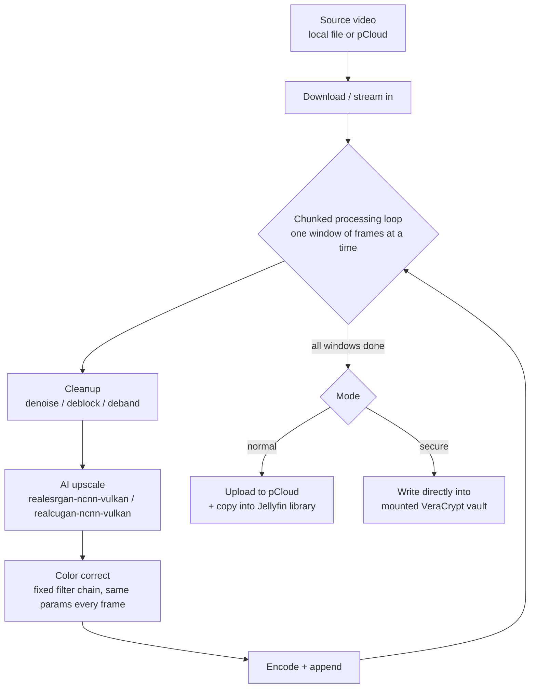
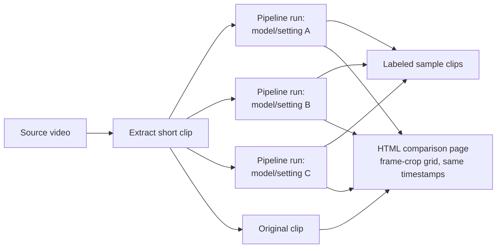
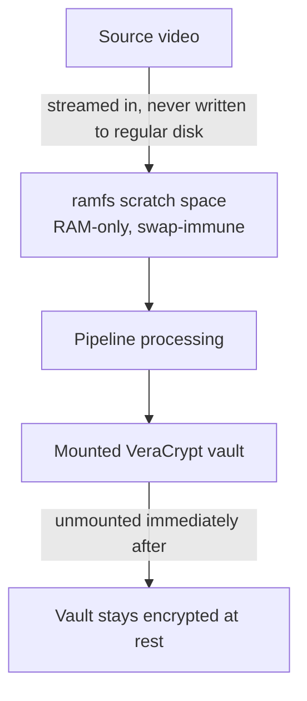

# 4k-no-jutsu

Config-driven pipeline for upscaling video to 4K with AI super-resolution,
cleaning up compression artifacts, and applying consistent color
correction. Supports comparing models/settings on short sample clips before
committing to a full run, and a secure mode that leaves no plaintext trace
on disk.

Design details: [docs/superpowers/specs/2026-08-03-video-upscale-pipeline-design.md](docs/superpowers/specs/2026-08-03-video-upscale-pipeline-design.md)

## Pipeline

Cleanup runs before upscaling so artifacts get fixed at native resolution
instead of being amplified by the upscaler. Color correction is a single
fixed set of parameters applied to the whole video, not a per-frame
auto-adjustment, so there's no flicker or drift between frames.

## Compare mode

Before committing to a full-length run, try several models/settings on a
short clip and compare them side by side:

## Secure mode

For source video that should leave no plaintext trace on disk:

`ramfs` (not `tmpfs`) is used for scratch space because it's never
swap-backed by the kernel, so the pipeline doesn't need system-wide swap
disabled. Mounting the vault and the `ramfs` scratch space both require an
interactive sudo prompt — secure mode is never run unattended.

## Status

Design approved, implementation not started yet. Blocked on a pending
reboot to fix an NVIDIA driver/library version mismatch on the host
machine (required for GPU-accelerated upscaling).
