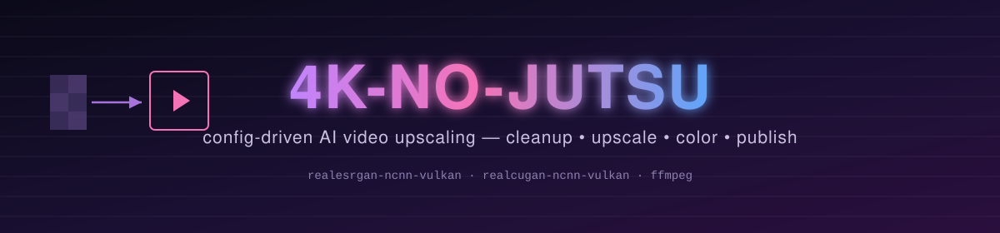
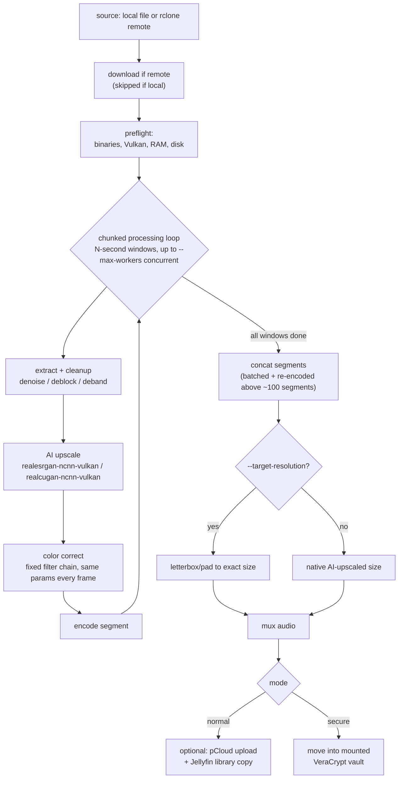
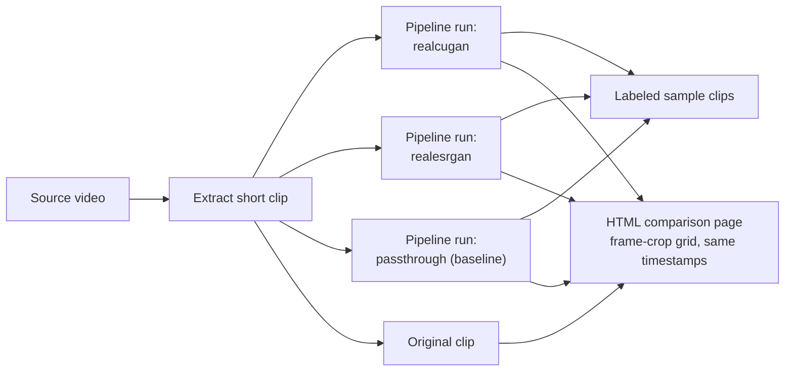
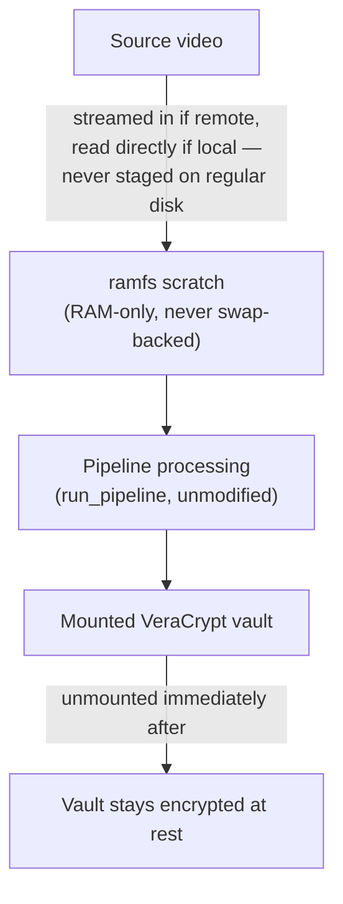

<p align="center">
  
</p>

<p align="center">
  A config-driven pipeline that takes any video, cleans it up, upscales it
  with an AI super-resolution model, color-corrects it, and lands it at an
  exact target resolution — normal mode publishes to pCloud/Jellyfin,
  secure mode never leaves plaintext on disk.
</p>

Works on any source ffmpeg can read, at any resolution — it isn't tied to
anime or the example job configs in this repo. Content-type **profiles**
just pick sensible defaults.

## Quick start

```bash
git clone https://github.com/DarrellBest/4k-no-jutsu ~/4k-no-jutsu
cd ~/4k-no-jutsu
./scripts/setup.sh          # conda env + jutsu install + AI backends
conda activate 4k-no-jutsu
```

```yaml
# job.yaml
source: /path/to/your/video.mp4
profile: anime   # or "live-action"
```

```bash
jutsu run job.yaml ./workdir --target-resolution 4k --max-workers 8
```

That's the whole thing: extract → cleanup → AI upscale → color correct →
concat → letterbox to 3840×2160 → mux audio → `./workdir/output.mp4`.

## Install

`scripts/setup.sh` does three things, in order, idempotently:

1. Creates the `4k-no-jutsu` conda env (Python 3.12) if it doesn't exist
2. `pip install -e ".[dev]"` — installs `jutsu` itself plus test dependencies
3. Runs `scripts/install_backends.sh`, which fetches the vendored
   `realesrgan-ncnn-vulkan` / `realcugan-ncnn-vulkan` binaries into `vendor/`

Everything's Vulkan-based, not CUDA — no GPU driver/toolkit version matching
required. Works even without a GPU via software rendering (e.g. mesa
lavapipe), just much slower; see [Performance](#performance).

## Usage

### Job config

One YAML file per job:

```yaml
source: /path/to/video.mp4        # local path, or an rclone remote like pcloud:Folder/video.mp4
profile: anime                    # anime | live-action — picks backend/model/scale/cleanup/color defaults
mode: normal                      # normal | secure
output_name: output.mp4

# All of these override the profile's defaults:
model:
  backend: realesrgan             # realesrgan | realcugan | passthrough
  name: realesr-animevideov3
  scale: 4
cleanup:
  denoise: 3.0
  deblock: 2.0
  deband: true
color:
  brightness: 0.0
  contrast: 1.0
  saturation: 1.0
  gamma: 1.0
```

`source` pointing at an rclone remote (`remote:path`) is downloaded
automatically before processing — local paths are used as-is.

### Run

```bash
jutsu run job.yaml ./workdir \
  --target-resolution 4k \
  --max-workers 8
```

| Flag | What it does |
|---|---|
| `--target-resolution` | Letterbox/pad the upscaled output to an exact size: `4k`/`uhd` (3840×2160), `1080p`, `720p`, or `WIDTHxHEIGHT`. AI backends only support fixed integer scale factors (2×/3×/4×), so this is what actually lands you on a standard size without distortion. Omit it to keep the backend's native scaled-but-unpadded output. |
| `--max-workers N` | Process N windows concurrently. The AI backend binaries are usually far from saturating a real GPU one window at a time — benchmark on your own hardware, then pick a number; going too high just shifts the bottleneck to CPU/disk. |
| `--no-publish` | Skip the publish step even in normal mode. |

### Compare mode

Before committing to a full-length run (which can take hours), try several
models/settings on a short clip:

```bash
jutsu compare job.yaml ./workdir --start 300 --duration 15
```

Runs the full pipeline once per (model, settings) combination on a short
clip, and writes `comparison.html` — a grid of frame crops at matching
timestamps across the original and every variant — plus labeled sample
clips you can drop straight into a media player.

### Publishing (normal mode, optional)

Both destinations are opt-in via environment variables. With neither set,
the finished file just stays in `./workdir` — that's the real output either
way.

```bash
export JUTSU_PCLOUD_REMOTE="myremote:SomeFolder"       # any rclone remote:path
export JUTSU_JELLYFIN_DIR="/path/to/jellyfin/media/Movies"
```

### Secure mode

For source video that should leave no plaintext trace on disk:

```bash
jutsu run job.yaml /mnt/ramfs_scratch \
  --vault-device /path/to/your.hc \
  --vault-mount /mnt/vault \
  --target-resolution 4k
```

Requires an **existing** VeraCrypt volume — create one yourself with the
`veracrypt` CLI/GUI and set your own passphrase; this tool never generates,
stores, or captures one. Mounting both the `ramfs` scratch space and the
vault requires root: you'll get the normal interactive `sudo` / VeraCrypt
passphrase prompts on your terminal each time a secure job starts — never
automated, never passwordless.

## How it works



Cleanup runs before upscaling so compression artifacts get fixed at native
resolution instead of amplified by the upscaler. Color correction is one
fixed set of parameters for the whole video, not per-frame auto-adjustment
— no flicker or drift between frames. Windows process independently
(disjoint frame/segment paths), which is what makes `--max-workers`
concurrency and per-window resumability both safe.

### Compare mode



### Secure mode



`ramfs` (not `tmpfs`) is used because it's never swap-backed by kernel
design. The kernel doesn't actually enforce ramfs's `size=` mount option
though, so the orchestrator polices its own cap and aborts cleanly if
exceeded — chunked processing keeps that cap small in practice, since only
one window's frames are ever resident at a time. Job state and the (fully
redacted — command names and exit codes only, never filenames or output)
per-job log both live inside the `ramfs` mount too, so nothing survives
regular disk or an unmount.

## Backends

| Backend | Notes |
|---|---|
| `realesrgan` | General + anime-tuned models (`realesrgan-x4plus`, `realesrgan-x4plus-anime`, `realesr-animevideov3`) |
| `realcugan` | Anime-specialized (`models-se` / `models-pro` / `models-nose`) |
| `passthrough` | Bicubic resize via Pillow, no AI, no GPU — the `live-action`/`anime` profile baseline comparison point, and usable today even without Vulkan |

Both AI backends are Vulkan-based ncnn binaries, not CUDA — no GPU driver
version matching against a specific toolkit release.

## Performance

Real numbers from an RTX PRO 6000, upscaling a ~90-minute source at scale=4:

| `--max-workers` | Real-world speed | Full movie estimate |
|---|---|---|
| 1 (sequential) | ~13x realtime | ~19 hours |
| 4 | ~4.5x realtime | ~6.7 hours |
| 8 | ~3.6x realtime | ~5.3 hours |

The AI backend binaries typically don't come close to saturating a real GPU
processing one window at a time (observed as low as 3-20% GPU utilization
at `--max-workers 1`), so concurrency gives a large real speedup — until
CPU/disk becomes the new bottleneck instead. Benchmark a short clip on your
own hardware (`jutsu run` on a `--duration`-trimmed source, or `jutsu
compare`) before picking a worker count for a full-length run.

## Testing

```bash
pytest tests/ -v
```

Config parsing, filter-chain construction, and pipeline-stage logic are
unit tested without a GPU. The AI backend tests run the real
`ncnn-vulkan` binaries against tiny synthetic clips generated on the fly —
this needs a working Vulkan implementation, which works even without a GPU
driver via software rendering (mesa lavapipe), just slower. Secure mode's
tests mock every privileged operation (no real root/VeraCrypt available in
CI) while exercising the real preflight/mount/cleanup logic and a genuine
(GPU-free, `passthrough` backend) pipeline run into a temp directory
standing in for the `ramfs`/vault mount points.

## Repository

- Design spec: [docs/superpowers/specs/2026-08-03-video-upscale-pipeline-design.md](docs/superpowers/specs/2026-08-03-video-upscale-pipeline-design.md)
- Implementation plan: [docs/superpowers/plans/2026-08-03-core-pipeline.md](docs/superpowers/plans/2026-08-03-core-pipeline.md)
- GitHub: [`DarrellBest/4k-no-jutsu`](https://github.com/DarrellBest/4k-no-jutsu), public
