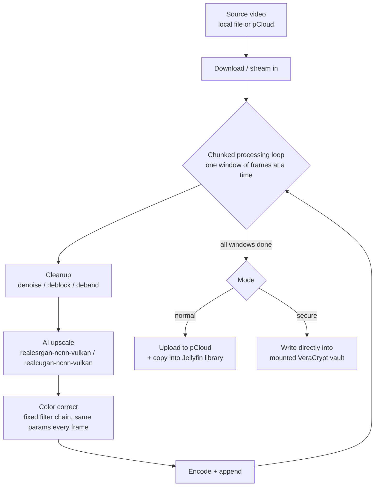
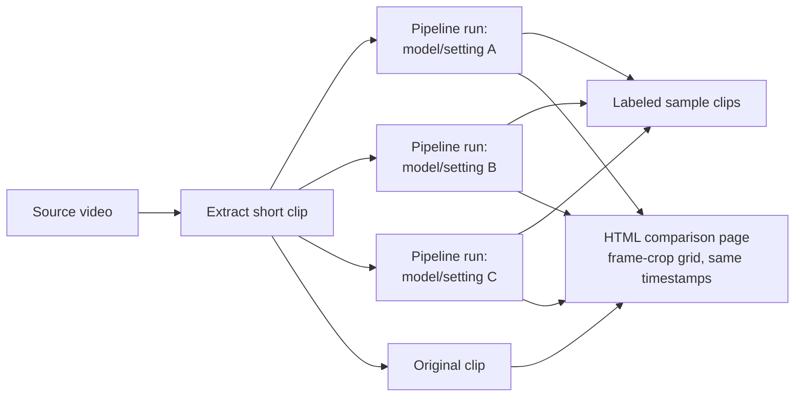
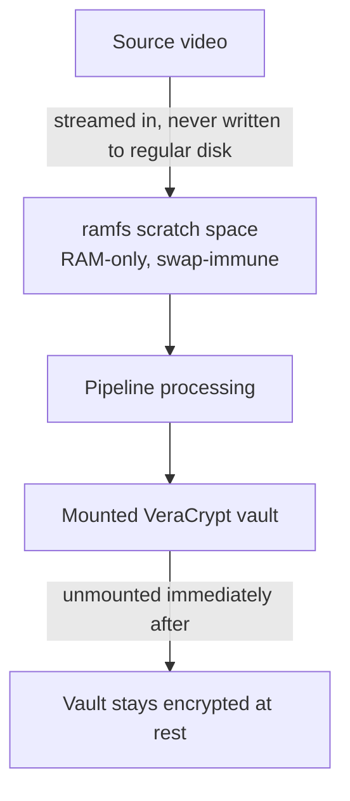

# 4k-no-jutsu

Config-driven pipeline for upscaling video to 4K with AI super-resolution,
cleaning up compression artifacts, and applying consistent color
correction. Supports comparing models/settings on short sample clips before
committing to a full run. A secure mode that leaves no plaintext trace on
disk is designed but not yet implemented (see Secure mode below).

Design details: [docs/superpowers/specs/2026-08-03-video-upscale-pipeline-design.md](docs/superpowers/specs/2026-08-03-video-upscale-pipeline-design.md)

## Pipeline



Cleanup runs before upscaling so artifacts get fixed at native resolution
instead of being amplified by the upscaler. Color correction is a single
fixed set of parameters applied to the whole video, not a per-frame
auto-adjustment, so there's no flicker or drift between frames.

## Compare mode

Before committing to a full-length run, try several models/settings on a
short clip and compare them side by side:



## Secure mode

For source video that should leave no plaintext trace on disk:



`ramfs` (not `tmpfs`) is used for scratch space because it's never
swap-backed by the kernel, so the pipeline doesn't need system-wide swap
disabled. Mounting the vault and the `ramfs` scratch space both require an
interactive sudo prompt — secure mode is never run unattended.

**Not implemented yet.** This section describes the planned design; secure
mode is a deliberately separate follow-up plan and does not exist in this
codebase today. A job config with `mode: secure` is refused at the CLI
(non-zero exit, no processing) rather than silently falling back to normal
mode.

## Status

Normal mode, compare mode, and the CLI are implemented and tested (15
implementation tasks complete). Task 16, the manual post-reboot GPU
verification against real NVIDIA hardware, is complete: the NVIDIA driver is
live post-reboot, and `jutsu compare` ran end-to-end against the real
`Naruto Shipuden Movie.mp4` source on the real GPU (RTX PRO 6000). Secure
mode is designed but not implemented (see the Secure mode section above).

**Real-hardware verification turned up and fixed one genuine bug** (not the
lavapipe flake noted below): the pipeline derived the frame rate used to
reassemble each processed window from ffprobe's `r_frame_rate`, which is
correct for constant-frame-rate sources but wrong for the variable-frame-rate
(VFR) encoding real anime rips typically use. On the real source this made
every backend's output play back roughly 2x too fast and come out
correspondingly short — confirmed to affect even the plain `passthrough`
backend, which has no GPU/timing logic of its own, isolating the bug to
shared pipeline code rather than the AI backends. Fixed by deriving the
assembly frame rate from the actual number of frames extracted per window
divided by that window's real duration, which is correct regardless of
source frame-rate characteristics. Covered by a new regression test
(`tests/test_pipeline.py`); full suite passing (57/57). This is exactly the
kind of defect the existing test suite's constant-frame-rate synthetic
fixtures could never catch, which is why it only surfaced once a real
source was used.

**Real full-length timing estimate** (measured on RTX PRO 6000, 5s windows,
15s sample clip at the 5-minute mark of the real source): realcugan
~13.5x realtime (~20 hours for the full ~90-minute movie), realesrgan
~14.2x realtime (~21 hours), passthrough (bicubic CPU/PIL, no GPU) ~28.9x
realtime (~43 hours) — notably slower than either GPU-accelerated AI
backend despite doing far less work per frame, since it runs single-threaded
in Python with no batching. `WINDOW_SECONDS = 5.0`'s per-window ffmpeg
subprocess overhead is a small fraction of these per-window processing
times, so the default chunk size doesn't need adjusting for correctness or
efficiency; a real full run should just be expected to take the better part
of a day.

Known flake, not a regression: during earlier development on this machine
(no working GPU driver yet, so tests ran on the CPU/lavapipe software Vulkan
fallback), the realcugan and realesrgan backends intermittently produced
zero output frames for a short clip, causing an unrelated failure a few
steps later. It was not reproducible in isolation and disappeared across
several full test-suite reruns, so it looked like a software-rendering
fallback quirk rather than a code defect — did not reproduce during the real
GPU verification above.

## Setup

Setup (environment + install + AI backends) is a separate, one-time step
from actually running the pipeline:

```
./scripts/setup.sh
conda activate 4k-no-jutsu
```

`scripts/setup.sh` creates the conda env, installs `jutsu` itself
(editable), and fetches the vendored `realesrgan`/`realcugan` ncnn-vulkan
binaries. It's idempotent — safe to re-run.

The test suite runs the AI backends' ncnn-vulkan binaries, so it needs a
working Vulkan implementation. This works even without a GPU driver, via
software rendering (e.g. mesa lavapipe for CPU-only Vulkan) — slower, but
functional for development.

## Running

`jutsu` works on any video ffmpeg can read, at any source resolution — it's
not anime- or Naruto-specific despite the job config examples. A minimal
job config:

```yaml
source: /path/to/your/video.mp4
profile: anime   # or "live-action" — picks default backend/model/cleanup
```

Run it, letterboxing the AI-upscaled output to an exact target resolution
(AI backends only support fixed integer scale factors, so this is usually
what you want to land on a standard size without distortion):

```
jutsu run job.yaml ./workdir --target-resolution 4k --max-workers 8
```

`--target-resolution` accepts `4k`/`uhd` (3840x2160), `1080p`, `720p`, or an
explicit `WIDTHxHEIGHT` like `3200x1800`. Omit it to keep the AI backend's
native scaled-but-unpadded output. `--max-workers` runs that many windows'
extract/upscale/assemble concurrently — the AI backend binaries are usually
far from GPU-saturated processing one window at a time, so this can give a
large real speedup on a capable GPU; benchmark on your own hardware before
picking a number; going too high shifts the bottleneck to CPU/disk instead.

For a long source, run `jutsu compare` first on a short clip to sanity-check
model choice and settings before committing to a full-length run — see
Compare mode below.

### Publishing (optional)

`jutsu run` (without `--no-publish`) will upload to pCloud and/or copy into
a Jellyfin media library after processing, but **only if configured** —
with neither set, the finished file just stays in your workdir (that's the
real output either way):

```
export JUTSU_PCLOUD_REMOTE="myremote:SomeFolder"   # any rclone remote:path
export JUTSU_JELLYFIN_DIR="/path/to/jellyfin/media/Movies"
```
